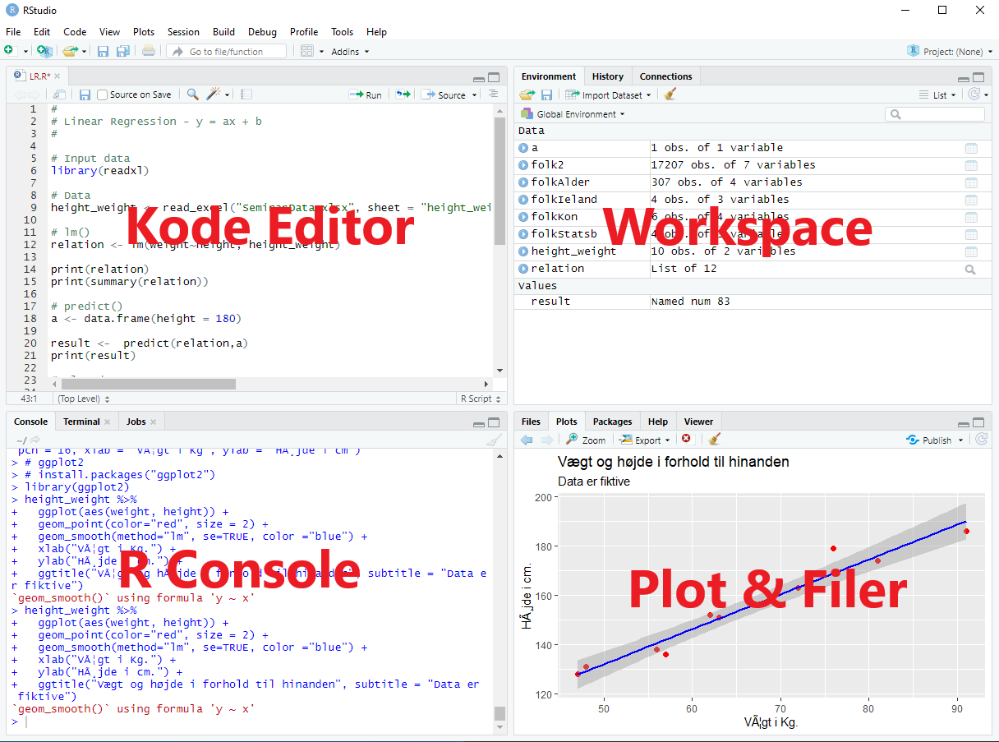

# R og RStudio {#R_RStudio}

Du skal have installeret R og det IDE udviklingsmiljø, der hedder RStudio, begge er open source og begge findes til Mac, Linux og Windows.

## R
Du skal downloade R fra 
<a href="https://cran.r-project.org" target="_blank">https://cran.r-project.org</a> 
Du skal her vælge den version, der passer til din computer – Linux, OS X (Mac) eller Windows.
Der er vejledninger for de forskellige installationer på www siden.

## RStudio
Når R er installeret, kan du bruge det, men for at gøre det nemmere bruger vi et udviklingsmiljø, der hedder RStudio. Rstudio findes i flere forskellige versioner, den du skal bruge er *RStudio Desktop Open Source License* 

Som du finder her: <a href="https://www.rstudio.com/products/rstudio/download/" target="_blank">https://www.rstudio.com/products/rstudio/download/</a> 
Du skal her vælge den version, der passer til din computer.

