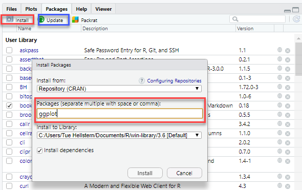

# Pakker {#pakker}
Du kan ”tilføje” funknationalitet til R ved at installere forskellige pakker. Du kan nederst til højre se, hvilke pakker du har installeret.
Det er også her muligt at opdatere de pakker, du har installeret.
Du kan finde en oversigt over de forskellige pakker her: <a href="https://cran.rstudio.com" target="_blank">cran.rstudio.com</a>

## Installation af pakker
Du kan installere pakker på to måder:

* Via RStudio - GUI
* Via R kode


**Grafisk**
I vinduet nederst til højre kan du klikke på fanen **Packages** og derefter på knappen **Install**, du skriver navnet på den eller de pakker du vil installere.



Det er også muligt at opdatere dine pakker vi knappen **Update**

I sammme vindue kan du også se hvilke pakker der er i *brug*.

**Kode**
Det er nemt at installere og bruge pakker via kode:

```
library()                     # Pakker der er på din computer
install.packages("ggplot2")   # install
library(dplyr)                # load

update.packages("tidyverse")  # Update
remove.packages("tidyverse")  # Fjern
```


